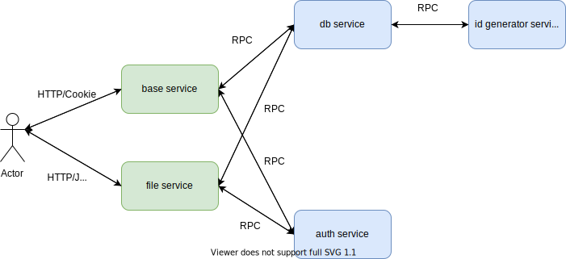

# WeFile

一个多用户微服务网盘系统

## 0X00 简单架构图

+ base service: 基本功能微服务，包括（用户注册、登录，创建、删除目录，创建、加入、删除、退出文件共享组等功能）使用 redis 做 session 的存储 
+ db service: mysql等数据库的封装微服务，使用 id gernerator service 作为发号器，生成每张表里的递增主键，方便后续分库分表

+ id gernerator service: 发号器微服务，使用「雪花算法」作为发号器的算法
+ auth service: 认证微服务，主要给 base service 到 file service 做 JWT 的解码和译码
+ file service: 文件微服务，用户从 base service 设置 JWT 的 Authorization 然后到 file service 真正上传文件，下载文件

整体使用 `etcd + go-micro` 做服务注册与发现，用 go-micro 实现微服务之间的「负载均衡」

## 0X01 功能介绍

+ 支持个人文件上传下载
+ 支持文件共享组中的用户文件分享，下载
+ 支持分块上传，断点续传，使用抽样 hash 加速前端 hash 的计算
+ 完成存储接口，支持多种存储的接入

## 0X02 待完成功能

+ 使用 mq 做异步转移，将保存在本地存储的文件异步转移到类似于 ceph，oss 的存储上
+ 断点下载
+ 日志收集
+ 配置信息数据库分发
+ 视频音频在线播放
+ ...

